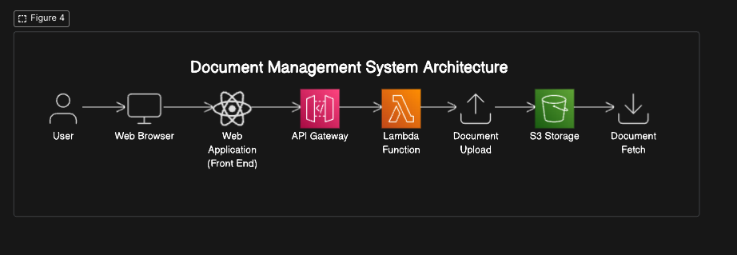

## Document Management System Architecture

#### Overview

This document describes the architecture of the Document Management System (DMS) designed to handle the uploading, storing, and fetching of documents. The system is built using a combination of front-end and back-end services, integrated with AWS resources for storage and processing.

